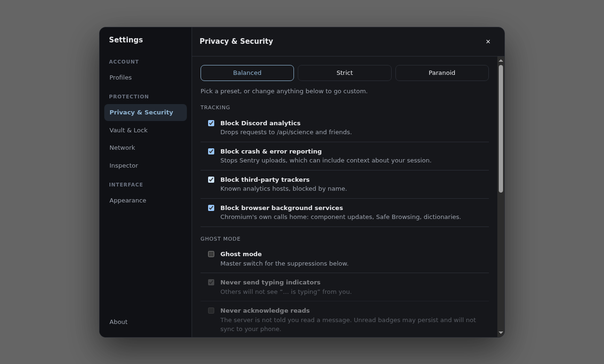

<div align="center">


# Sable

**A hardened, portable, multi-channel desktop client for Discord.**

Stable, PTB and Canary · real session isolation · privacy you can audit

</div>

---

Sable is a purpose-built browser that loads Discord's own web application and
enforces privacy and security policy from **outside** the page, where the page
cannot see or subvert it.

It does not patch Discord, inject scripts into it, or speak to the Discord API
on your behalf. From Discord's side it is a browser session, because it is one.

> **Status:** early. The architecture, privacy engine, profile system and
> hardening are implemented and tested. See [the roadmap](docs/ROADMAP.md) for
> what is not built yet.

## Why this exists

Most third-party Discord clients pick one of two paths: reimplement the API
(which is what anti-abuse systems are built to catch), or inject plugins into
the official client (which runs arbitrary third-party JavaScript inside the
origin holding your session token). Both are reasonable engineering; neither is
a good foundation for a client whose headline claim is privacy.

Sable takes the third path — the hardened shell — and pushes it further than a
wrapper usually goes: genuine per-profile session isolation, Telegram-style
portability, a policy engine you can unit-test, and a live inspector that shows
you what was blocked instead of asking you to trust a feature list.

Full reasoning, including what the reference implementations get right, is in
[docs/RESEARCH.md](docs/RESEARCH.md).

## What you get

**All three release channels, side by side.** Stable, PTB and Canary are
separate origins with separate sessions, so run them at once, signed into
different accounts, colour-coded so you always know which build you are in.

**Profiles that are actually isolated.** Each profile owns a Chromium session
partition — its own cookies, storage, cache and service workers. Two profiles
cannot observe each other. Ephemeral profiles vanish completely on close.

**Ghost Mode.** Never send a typing indicator. Never acknowledge a read. Never
upload a call quality report. Implemented by dropping requests at the network
layer, not by patching the page — with the side effects documented honestly
rather than glossed over.

**Privacy you can check.** Every block is listed live in the Privacy Inspector
with its category, method and full URL. The classifier is a single pure module
covered by unit tests, so "we block telemetry" is a claim you can run.

**Per-profile egress.** A proxy is a session-level setting in Chromium, which
makes a profile the right granularity: route one identity over Tor or a VPN and
leave another direct. Plus DNS-over-HTTPS, so your network operator does not get
a plaintext list of every host you contact.

**Portable like Telegram.** Put a `sable-data` directory next to the
executable and Sable keeps everything there and touches nothing else.

**Zero runtime dependencies.** Every package in `node_modules` is a build-time
tool. What reaches your machine is Electron and this repository.

<div align="center">



</div>

## Privacy at a glance

| | Balanced (default) | Strict | Paranoid |
| --- | :---: | :---: | :---: |
| Discord analytics, Sentry, trackers | ● | ● | ● |
| Chromium background services | ● | ● | ● |
| Typing indicators suppressed | ○ | ● | ● |
| Read receipts suppressed | ○ | ● | ● |
| Embedded activities blocked | ○ | ● | ● |
| Off-platform media blocked | ○ | ○ | ● |
| WebRTC | default route only | default route only | no non-proxied UDP |
| Permissions | ask / deny | ask / deny | ask everything |

Proxy (per profile) and secure DNS are configured separately, in **Network** —
they are network decisions that outlive a privacy preset, so changing preset
never resets them.

Details, side effects, and an honest list of what Sable **cannot** do are in
[docs/PRIVACY.md](docs/PRIVACY.md). The short version of the limits: presence
and online status travel inside the gateway WebSocket and are not filterable
without injecting code into the page, which this project deliberately refuses
to do. Use Discord's own invisible status for that.

## Getting started

Requires Node 20+.

```bash
npm install
npm start          # build and run
npm test           # 63 unit tests over the pure policy/rule/network modules
npm run test:e2e   # 16 end-to-end tests that launch the real app
npm run dist       # package for the current platform
```

`test:e2e` needs a display and a non-root user (Chromium's sandbox refuses to
run as root). On a headless machine, prefix it with `xvfb-run -a`.

### Portable mode

Any one of these puts all state in a directory beside the executable:

```bash
mkdir sable-data          # a marker directory is enough
./sable --portable
SABLE_PORTABLE=1 ./sable
./sable --data-dir=/mnt/usb/sable
```

The single-instance lock is keyed on the data directory, so two portable copies
in two folders run side by side while a second launch of the same copy just
focuses the window you already have.

If the portable directory turns out to be read-only, Sable falls back to the OS
location and tells you in **About** rather than silently failing to persist.

### Shortcuts

| | |
| --- | --- |
| <kbd>Ctrl/Cmd</kbd>+<kbd>P</kbd> | Profiles |
| <kbd>Ctrl/Cmd</kbd>+<kbd>,</kbd> | Privacy settings |
| <kbd>Ctrl/Cmd</kbd>+<kbd>Shift</kbd>+<kbd>N</kbd> | Network (proxy, DNS) |
| <kbd>Ctrl/Cmd</kbd>+<kbd>Shift</kbd>+<kbd>I</kbd> | Privacy Inspector |
| <kbd>Ctrl/Cmd</kbd>+<kbd>R</kbd> | Reload the Discord view |
| <kbd>Esc</kbd> | Close the panel |

## Documentation

| | |
| --- | --- |
| [RESEARCH.md](docs/RESEARCH.md) | The client landscape, what Discord sends, and why this design |
| [ARCHITECTURE.md](docs/ARCHITECTURE.md) | Process layout, module map, request pipeline |
| [PRIVACY.md](docs/PRIVACY.md) | Exactly what is blocked, and what cannot be |
| [SECURITY.md](docs/SECURITY.md) | Threat model, hardening, fuses, IPC surface |
| [ROADMAP.md](docs/ROADMAP.md) | What is not built yet, and what is out of scope forever |

## A word on Discord's Terms

Discord's terms prohibit modifying the client, and Discord discourages
third-party clients generally. Sable loads Discord's unmodified web app, injects
nothing into it, and reimplements no API — it blocks some of its own outbound
requests, the same category of action as running an ad blocker in Firefox.

That is a materially different posture from a patched client, and it is the
lowest-risk way to get real privacy control. It is not a guarantee, and anyone
offering you one is not being straight with you. The trade-off is yours to
make; see [docs/RESEARCH.md](docs/RESEARCH.md#terms-of-service) for the full
reasoning.

## Not affiliated with Discord

Sable is an independent project. Discord is a trademark of Discord Inc., which
has no involvement in this software.

## License

MIT — see [LICENSE](LICENSE).
