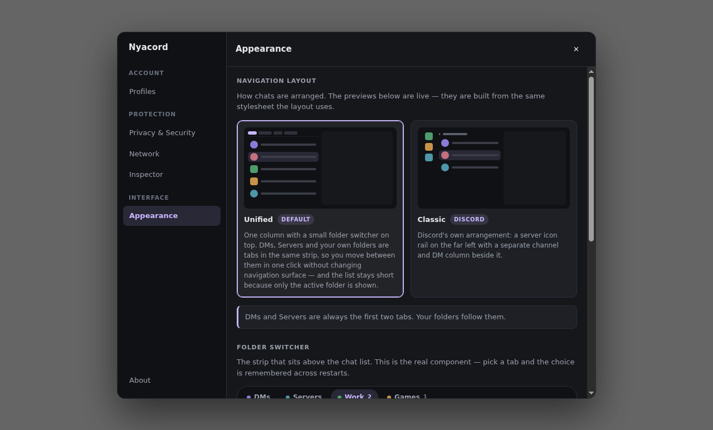

<div align="center">


# Nyacord

**A hardened, portable Discord client for Stable, PTB and Canary.**

</div>

---

Nyacord is a purpose-built browser that loads Discord's web app and applies
privacy and security policy from outside the page, where the page cannot see or
change it.

It does not patch Discord, inject scripts into it, or call the Discord API for
you. From Discord's side it is a browser session, because it is one.

> **Status:** early. The architecture, privacy engine, profiles and hardening
> work and are tested. [ROADMAP.md](docs/ROADMAP.md) lists what is missing.

## Why

Third-party Discord clients usually take one of two routes. They reimplement the
API, which is the pattern anti-abuse systems look for, or they inject plugins
into the official client, which runs third-party JavaScript inside the origin
holding your session token. Both are fine engineering. Neither is a good base
for a client whose main claim is privacy.

Nyacord takes the third route, the hardened shell, and goes further with it than
a wrapper normally does: per-profile session isolation, Telegram-style
portability, a policy engine covered by unit tests, and an inspector that shows
what was blocked.

[docs/RESEARCH.md](docs/RESEARCH.md) has the full comparison.

## What you get

**Three release channels at once.** Stable, PTB and Canary are separate origins
with separate sessions. Run them side by side, signed into different accounts,
colour-coded so you know which build you are looking at.

**Profiles that are really isolated.** Each profile owns a Chromium session
partition: its own cookies, storage, cache and service workers. Two profiles
cannot see each other. Ephemeral profiles disappear on close.

**Ghost Mode.** No typing indicators, no read acknowledgements, no call quality
uploads. Done by dropping requests at the network layer, not by patching the
page. The side effects are written down in [PRIVACY.md](docs/PRIVACY.md).

**A privacy inspector.** Every blocked request is listed live with its category,
method and URL. The classifier is one pure module with unit tests over it.

**Per-profile egress.** Chromium attaches proxies to sessions, so a profile is
the right unit: send one identity over Tor or a VPN and leave another direct.
DNS-over-HTTPS keeps your network operator from seeing a plaintext list of the
hosts you contact.

**A merged DM and server list.** `Unified` (the default) puts a switcher above
one chat list, the way Telegram does: DMs on one side, Servers on the other, one
on screen at a time, and the side you were on survives a restart. `Classic`
gives you Discord's normal layout. Server folders and their drag and drop are
Discord's own, so they keep working and stay synced to your account. Nothing is
injected into Discord. See
[how far this goes](docs/ROADMAP.md#the-unified-layout).

**Portable.** Drop a `nyacord-data` directory next to the executable and
everything lives there.

**No runtime dependencies.** Everything in `node_modules` is a build tool. What
reaches your machine is Electron and this repository.

<div align="center">



</div>

## Privacy presets

| | Balanced (default) | Strict | Paranoid |
| --- | :---: | :---: | :---: |
| Discord analytics, Sentry, trackers | ● | ● | ● |
| Chromium background services | ● | ● | ● |
| Typing indicators suppressed | ○ | ● | ● |
| Read receipts suppressed | ○ | ● | ● |
| Embedded activities blocked | ○ | ● | ● |
| Off-platform media blocked | ○ | ○ | ● |
| WebRTC | default route only | default route only | no non-proxied UDP |
| Permissions | ask / deny | ask / deny | ask everything |

Proxy and secure DNS live in **Network** and are not part of a preset, so
changing preset never resets them.

[PRIVACY.md](docs/PRIVACY.md) covers the details, the side effects, and the
things Nyacord cannot do. The main limit: presence and online status travel
inside the gateway WebSocket, which a shell cannot filter without running code
in the page. Use Discord's invisible status for that.

## Getting started

Needs Node 20 or newer.

```bash
npm install
npm start          # build and run
npm test           # 73 unit tests over the pure modules
npm run test:e2e   # 20 end-to-end tests against the real app
npm run dist       # package for the current platform
```

`test:e2e` needs a display and a non-root user, since Chromium's sandbox will
not run as root. On a headless box, prefix it with `xvfb-run -a`.

### Portable mode

Any of these keeps all state next to the executable:

```bash
mkdir nyacord-data          # the directory alone is enough
./nyacord --portable
NYACORD_PORTABLE=1 ./nyacord
./nyacord --data-dir=/mnt/usb/nyacord
```

The single-instance lock is keyed on the data directory, so two portable copies
in two folders run side by side, while launching the same copy twice just
focuses the window you already have.

If the portable directory turns out to be read-only, Nyacord falls back to the
OS location and says so in **About**.

### Shortcuts

| | |
| --- | --- |
| <kbd>Ctrl/Cmd</kbd>+<kbd>P</kbd> | Profiles |
| <kbd>Ctrl/Cmd</kbd>+<kbd>,</kbd> | Privacy & Security |
| <kbd>Ctrl/Cmd</kbd>+<kbd>Shift</kbd>+<kbd>N</kbd> | Network |
| <kbd>Ctrl/Cmd</kbd>+<kbd>Shift</kbd>+<kbd>I</kbd> | Inspector |
| <kbd>Ctrl/Cmd</kbd>+<kbd>Shift</kbd>+<kbd>A</kbd> | Appearance |
| <kbd>Ctrl/Cmd</kbd>+<kbd>R</kbd> | Reload the Discord view |
| <kbd>Esc</kbd> | Close the panel |

## Documentation

| | |
| --- | --- |
| [RESEARCH.md](docs/RESEARCH.md) | The client landscape, what Discord sends, why this design |
| [ARCHITECTURE.md](docs/ARCHITECTURE.md) | Process layout, module map, request pipeline |
| [PRIVACY.md](docs/PRIVACY.md) | What is blocked, and what cannot be |
| [SECURITY.md](docs/SECURITY.md) | Threat model, hardening, fuses, IPC surface |
| [ROADMAP.md](docs/ROADMAP.md) | What is missing, and what is out of scope |

## Discord's Terms

Discord's terms prohibit modifying the client, and Discord discourages
third-party clients in general. Nyacord loads the unmodified web app, injects
nothing, and reimplements no API. It blocks some of its own outbound requests,
which is the same class of action as running an ad blocker in Firefox.

That is a different position from a patched client, and it is the lowest-risk
way to get real privacy controls. It is not a guarantee and nobody can give you
one. [docs/RESEARCH.md](docs/RESEARCH.md#terms-of-service) has the reasoning if
you want to weigh it yourself.

## Not affiliated with Discord

An independent project. Discord is a trademark of Discord Inc., which has no
involvement in this software.

## License

MIT, see [LICENSE](LICENSE).
